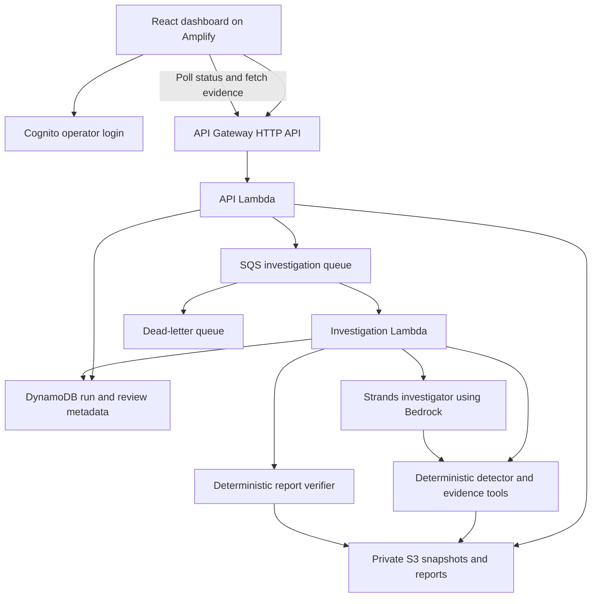

# ColdChain Guardian — implementation plan

Prepared 17 September 2026. Status: ready for implementation; no application has been built or deployed. Team: Cyril (leader), Harshith, Navadeep. Ship It selected; user confirms AWS account and event credits are available. Assignments follow the user’s requested ownership. Only Cyril deploys resources to the team’s credited AWS account.

## Read and distribute

1. Everyone reads this plan and [shared contracts](docs/CONTRACTS.md).
2. Cyril follows [leader assignment](docs/01-CYRIL.md).
3. Harshith follows [backend assignment](docs/02-HARSHITH.md).
4. Navadeep follows [frontend assignment](docs/03-NAVADEEP.md).
5. Cyril uses [verification and release gates](docs/VERIFICATION.md) to accept work.
6. Everyone follows the [one-account cloud workflow](docs/TEAM-CLOUD-WORKFLOW.md): local development for teammates, cloud deployment by Cyril.

These are implementation instructions, not claims that the system already meets the gates. Commands and source paths in the assignment documents describe files the team must create.

## 1. Outcome and scope

Build a web application for a pharmaceutical distributor's quality reviewer. Given a simulated refrigerated shipment's temperature readings and equipment/door events, it detects out-of-range readings, compares possible explanations, displays the supporting and conflicting evidence, and exports an incident report for human review.

Pitch: “Turn a cold-chain temperature alert into an evidence-backed investigation report.”

The MVP has one shipment per run, Celsius temperatures, one versioned illustrative handling policy, four incident scenarios and one normal control. Each incident scenario contains one investigation window. Additional separated excursions in an imported/future dataset must be flagged as unsupported rather than silently combined.

Required user journey:

1. A visitor opens a working AWS URL and inspects a completed, explicitly simulated demonstration.
2. A signed-in team operator selects a scenario and starts a fresh investigation.
3. The backend generates a complete, reproducible telemetry snapshot, detects an excursion, and starts background analysis.
4. The dashboard shows the temperature chart, event timeline and actual processing stages.
5. The investigator retrieves evidence through tools and compares explanations.
6. A deterministic verifier checks the report; the user sees a supported hypothesis or an unresolved result, with evidence links.
7. An operator acknowledges review and records a note. The app exports a JSON report plus a printable report page.

This weekend's product processes a recorded telemetry snapshot. The data and optional chart replay are simulated; the AWS request, detection, tool calls, verification, persistence and report are real. Do not describe it as deployed truck monitoring. A snapshot includes only evidence up to its recorded cutoff. A future live adapter would submit successive snapshots and report revisions.

Not in MVP: physical sensors, truck control, medicine release/disposal decisions, route optimisation, multi-tenant onboarding, document uploads, vector search, multi-agent orchestration, predictive spoilage, continuous MQTT ingestion, native mobile app, email/SMS integrations.

## 2. Verified event requirements

The event distinguishes local AWS open-source projects (Build It) from AWS-deployed projects with a URL (Ship It). It requires meaningful AWS use, not every service in its examples. Use the cloud architecture below for Ship It. [Official overview](https://www.wemakedevs.org/aws/first-commit).

Project work must be new within the event window. Submission needs a public repository, a short writeup and a YouTube video under three minutes that actually shows AWS use. Disclose AI coding tools. Each member registers individually and checks their student-profile requirements. [Official rules](https://www.wemakedevs.org/aws/first-commit/rules).

The schedule lists September 20 as submission day but the retrieved page does not specify an exact closing time or timezone. Leader checks the form/organiser announcement and writes the confirmed deadline in the repo; do not assume midnight IST. [Official schedule](https://www.wemakedevs.org/aws/first-commit/schedule).

## 3. Fixed stack

| Layer | Choice | Purpose and owner |
|---|---|---|
| UI | React + TypeScript + Vite | Static dashboard; Navadeep |
| UI components | Tailwind CSS, shadcn/ui, Lucide | Fast consistent interface; Navadeep |
| Charts and server state | Recharts, TanStack Query | Evidence chart and polling; Navadeep |
| Hosting | AWS Amplify Hosting | Public HTTPS URL; leader deploys Navadeep's build |
| Authentication | Cognito user pool, managed login, public client with PKCE | Team operator login; leader configures, Navadeep integrates |
| HTTP API | API Gateway HTTP API + Python Lambda | Small validated endpoints; Harshith |
| Backend libraries | Python 3.12, Pydantic v2, boto3 | Schemas, validation and AWS adapters |
| Investigation | Strands Agents SDK for Python + Amazon Bedrock | Tool-using investigator; leader |
| First model candidate | Amazon Nova Lite via Bedrock | Explicit configurable model ID; leader tests before locking |
| Background jobs | SQS + investigation Lambda + dead-letter queue | Durable background execution; leader |
| Status and review storage | DynamoDB on-demand | Run/job/review metadata; Harshith |
| Evidence and report storage | Private S3 bucket | Immutable JSON snapshots and reports; Harshith |
| Infrastructure | AWS SAM / CloudFormation | Reproducible API, workers, roles and storage; leader |
| Logs | CloudWatch | Request/run IDs, errors, timings and tool metadata |
| Verification | pytest, Ruff, Vitest, Playwright, GitHub Actions | Meaningful tests and review gates |

Use one Python backend project and one TypeScript frontend project. Do not add Next.js, FastAPI, Node backend or a second database. Plain Lambda handlers keep packaging and deployment straightforward. Pin tested package versions in lockfiles on day one; do not guess future/latest versions in this plan.

Start with `AWS_REGION=us-east-1`, entirely synthetic data, and test `BEDROCK_MODEL_ID=amazon.nova-lite-v1:0`. If this account requires a supported inference profile, validate and record that ID instead. Model availability, permissions and tool-use quality must pass the first-hour smoke test; the documentation is not proof of account access. [Nova Lite model card](https://docs.aws.amazon.com/bedrock/latest/userguide/model-card-amazon-nova-lite.html), [model access](https://docs.aws.amazon.com/bedrock/latest/userguide/model-access.html).

Use current Strands structured output with a Pydantic schema passed as `structured_output_model`; read `result.structured_output`. Pin the version proven by the smoke test. Do not start from deprecated `agent.structured_output()` examples. [Strands documentation](https://strandsagents.com/docs/user-guide/concepts/agents/structured-output/).

IoT Core is optional later: there is no physical device or MQTT requirement in this MVP. OpenSearch, Cedar, AgentCore and Step Functions are also unnecessary for this particular implementation. Amplify hosts the static UI; SAM owns the backend, avoiding competing infrastructure systems.

## 4. Architecture



API submission returns quickly after persistence and successful enqueue. Investigation does not run inside the HTTP request: HTTP API integration timeout is 30 seconds. [AWS quota reference](https://docs.aws.amazon.com/apigateway/latest/developerguide/http-api-quotas.html).

Worker initial settings: timeout 120 seconds, application deadline 90 seconds, batch size 1, SQS visibility 720 seconds, maxReceiveCount 3, dead-letter retention 7 days. Handle duplicate delivery and conditional job leases. These are project configuration choices; AWS recommends at least six times the function timeout for SQS visibility. [AWS configuration guidance](https://docs.aws.amazon.com/lambda/latest/dg/services-sqs-configure.html).

First-hour model test must include one tool call and one validated structured result from the chosen deployment identity. A plain “hello” response is insufficient.

## 5. Work split

| Developer | Responsibility | Acceptance authority |
|---|---|---|
| Cyril — you | Contracts, detector, investigation tools, AI, verifier, evaluation, infrastructure, integrations and release | Final merge/release owner |
| Harshith | Deterministic simulator, S3/DynamoDB adapters, API routes and backend tests | Leader reviews |
| Navadeep | Dashboard, chart, evidence interactions, login client, printable report and UI tests | Leader reviews |

Do not make yourself a blocker for every small change. Publish valid example responses, a storage interface and a loopback-only development API harness first. Teammates build against those while you work on the investigator. Give them ownership of their tests and documentation so all verification does not fall on you at the end. Neither teammate needs an AWS account or AWS credentials. They hand code and build artifacts to Cyril, who deploys one shared cloud environment.

## 6. Integration schedule

Times below are work budgets, not an invented event closing time. Let D be the officially confirmed submission deadline.

| Milestone | Leader | Backend | Frontend | Exit condition |
|---|---|---|---|---|
| First 60–90 minutes | Confirm kickoff/deadline; test Bedrock and AWS permissions; publish contracts/examples | Read contracts, sketch simulator and adapter tests | Read contracts, sketch dashboard with contract fixtures | Model/tool smoke passes; everyone agrees on v1 fields |
| Sept 17, first build block | Repo scaffold, CI, SAM skeleton, detector skeleton | Generate seeded normal and door snapshots; implement memory adapter | Build page skeleton, chart and typed API client | One fixture renders correctly; one detector test passes |
| Sept 18, first half | Deploy storage/API/queue; implement evidence tools | Real AWS adapters; POST/GET routes and idempotency | Replace mocks with deployed API; basic auth flow | One cloud run creates, polls and displays real data |
| Sept 18, second half | Bedrock investigation, verifier and report persistence | Remaining scenarios, queue failure handling, review endpoint | Evidence links, conflicts, error and review states | Door scenario works end to end on AWS |
| Sept 19 | Holdout tests, degraded paths, IAM/cost review | Integration regression, retry repair script | Finish print view, accessibility and E2E checks | All release blockers pass; fresh browser demo works |
| Sept 20, before D−6h | Freeze features; full acceptance and tagged commit | README/API docs and defect fixes | Video capture support and visual defects | Reproducible release candidate |
| Before D−3h | Record and verify submission links | Verify clean-clone setup | Verify signed-out video/app experience | Upload complete with time to recover |

Target approximately 22–28 focused hours for the leader and 14–20 hours for each teammate. This is an estimate; account setup and unfamiliar tools can expand it. Cut optional features before expanding the time budget.

## 7. Repository and merge workflow

Proposed implementation layout:

```text
apps/web/                       # Navadeep
backend/coldchain/contracts/     # Cyril; shared frozen definitions
backend/coldchain/core/          # Cyril: detector and measurements
backend/coldchain/investigation/ # Cyril: tools, agent, verifier
backend/coldchain/worker/        # Cyril: job handler
backend/coldchain/api/           # Harshith
backend/coldchain/storage/       # Harshith, interfaces approved by leader
backend/coldchain/simulator/     # Harshith
backend/tests/core/              # Cyril
backend/tests/investigation/     # Cyril
backend/tests/api/               # Harshith
backend/tests/storage/           # Harshith
backend/tests/simulator/         # Harshith
contracts/examples/             # Cyril publishes public mock responses
eval/                           # Cyril; labels excluded from runtime packages
infra/                          # Cyril
scripts/                        # Cyril, named handoffs permitted
docs/                           # plan and developer documentation
.github/                        # Cyril
```

One monorepo, three branches: `feat/investigation-core`, `feat/data-api`, `feat/dashboard`. Teammates submit small PRs at each milestone; only leader merges to main. Rebase after merges. Agree explicitly before editing another owner's files. No force-push to main or credentials in commits. CODEOWNERS records responsibilities; verify whether the repository plan supports enforcement rather than assuming it does.

PR template: what changed; contract impact; tests run with results; screenshot or sample response; unresolved limitations. Leader verifies results independently at integration points. CI performs offline tests by default; Bedrock evaluations are explicit, bounded runs.

## 8. Architecture decisions and trade-offs

| Decision | Alternative considered | Reason / trade-off | Revisit when |
|---|---|---|---|
| Recorded snapshots | Continuous IoT stream | Reproducible weekend tests; gives up live truck integration | A real sensor feed exists |
| One tool-using investigator | Several specialised agents | Fewer failure points and lower cost; no parallel agent workflow | Evaluation proves a need |
| Deterministic numbers and verifier | LLM computes and checks its answer | Reproducible metrics; semantic cause still needs evidence review | Never delegate numeric authority without equivalent guarantees |
| SQS worker | Synchronous API or Step Functions | Avoids HTTP timeout; requires retry/idempotency code | Workflow needs multiple independently managed stages |
| S3 snapshots, DynamoDB metadata | Store all readings in DynamoDB or SQL | Small immutable batches are easy to inspect; no arbitrary analytics queries | Large-scale querying becomes a requirement |
| Static Vite UI | SSR framework | Straightforward Amplify deployment; no server rendering | Product needs server-rendered pages |
| Cognito operator access, public curated demos | Anonymous paid runs | Reviewers can inspect without login; paid operations restricted | Public interactive use has a controlled access model |

## 9. Cost and deployment limits

Available credits are confirmed by the user; exact service coverage and remaining balance are not verified. Leader checks both before deployment. Record model price and an estimate from measured token usage; do not promise a zero bill.

Initial project limits: one active run per operator, 50 new runs per UTC day across the demo, at most 8 model invocations and 12 tool calls per run, bounded output and input sizes, 90-second worker deadline. Enforce limits in code with atomic counters; SDK retries count toward the request budget. Start with 2 concurrent workers, confirm account concurrency limits, and reduce if necessary. A budget alert is a notification, not a hard stop.

Use no NAT gateway, always-on database, provisioned model throughput or Marketplace-hosted endpoint. S3 remains private; temporary artifact links expire. Logs omit tokens and raw prompts. Configure short log retention and dataset lifecycle. Keep the demo available through judging; document a teardown command and run it only after the required availability period.

## 10. Priorities

Required blockers: a real AWS URL, at least the four incident cases plus normal control, truthful processing state, numeric/evidence validation, working review/export, model-failure behaviour, access control for paid operations, and reproducible submission evidence.

Recommended soon: feedback from one domain user, CSV import through the same validated snapshot contract, additional sensor-placement cases, measured comparison with deterministic rules.

Optional non-blocking: physical sensor, map animation, MQTT/IoT Core, PDF service, notifications, multiple agents. Browser print-to-PDF is sufficient for this weekend.

See the assignment files for exact implementation steps and [verification](docs/VERIFICATION.md) for the release decision.
